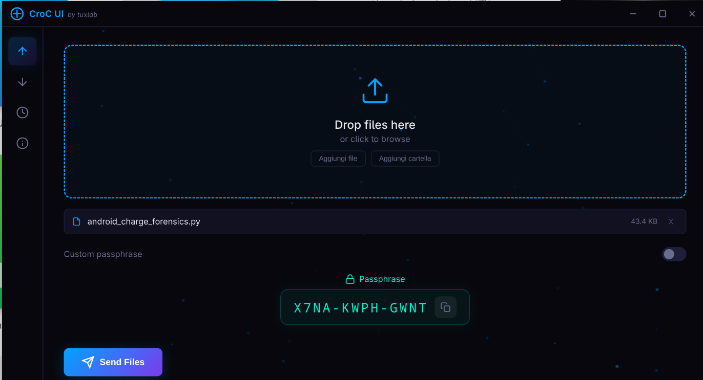
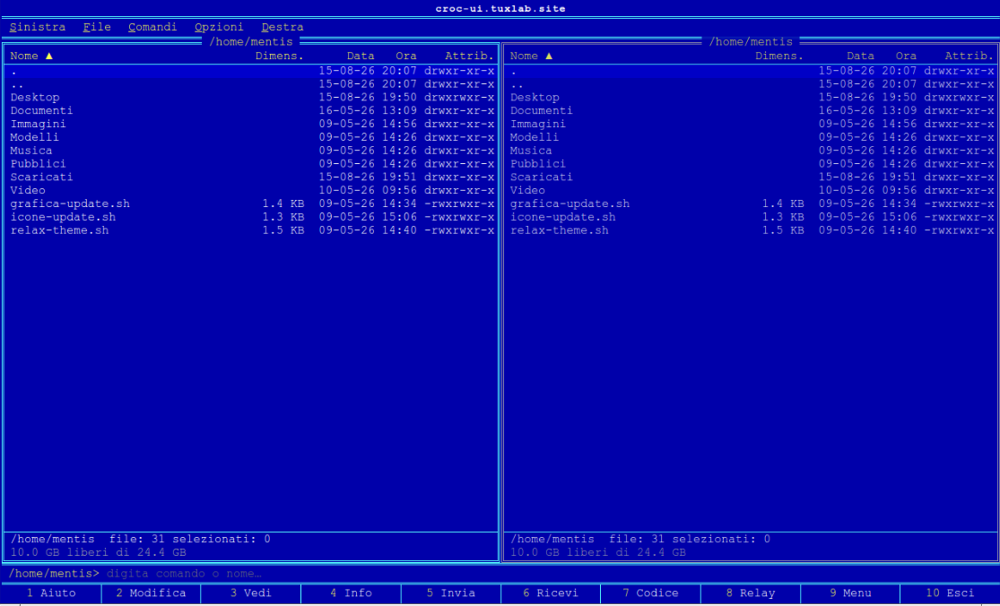

[🇮🇹 Italiano](README.md) | [🇬🇧 English]

---

# ⬆️ Croc UI ⬇️ (by TuxLab)

<br>


## 📌 About the Project


**CroC UI** is a modern and intuitive graphical user interface (GUI) designed for <a href="https://github.com/schollz/croc" target="_blank" rel="noopener noreferrer">CroC</a>, the powerful CLI tool that allows easy and secure transfer of files and folders between computers.
 [Source code Croc-UI](https://github.com/reverseloop-dev/Croc-UI-TuxLab)
 
---

<br>
<p align="center">
  
</p>
<br>

---

The main goal of this project is to simplify file sharing between **Windows systems, Linux distributions, and virtual machines**, providing a convenient and user-friendly GUI that eliminates the need to use the terminal or command line.

---

## ✨ Key Features

* **No Shell / Terminal:** Send and receive files using an intuitive graphical interface.
* **Cross-Platform:** Optimized for maximum compatibility between **Windows** and **Linux**.
* **File and Folder Transfer:** Send individual files or entire directories with just a few clicks.
* **Built-in Security:** Leverages the end-to-end encryption provided by *croc* (PAKE).
  
*While several GUIs for *CroC* already exist, this project was born out of a specific need to **drastically simplify the visual experience**, making the process intuitive and immediate so that anyone can figure out how to send or receive files at first glance, without complications.*

---

## 🛠️ Requirements

CroC UI relies on the original `CroC` engine. Make sure you have `CroC` installed on your system or refer to the official repository:
👉 <a href="https://github.com/schollz/croc" target="_blank" rel="noopener noreferrer">https://github.com/schollz/croc</a>

> ⚠️ **Important note:** All communicating clients must use the **same version** of `CroC` to ensure compatibility.
<br>

<p align="center">
  <a href="https://git.io/typing-svg">
  
</a>
</p>

    
### 🪟 Installing CroC on Windows  
1️⃣ Open **Command Prompt** or **PowerShell** and run:

```bash
winget install schollz.croc
```

🪟 CroC-UI on Windows  

2️⃣ Download 👉 [CroC-UI Windows](https://github.com/reverseloop-dev/Croc-UI-TuxLab/releases/download/definitivo/CroC-UI_1.0_Win64.exe)
<br>

---

🐧 Installing CroC on Linux  

1️⃣ Open the Terminal and run:

```bash
curl https://getcroc.com | bash
```

🐧 Croc UI on Linux  

2️⃣ Download 👉 [Croc UI Linux](https://github.com/reverseloop-dev/Croc-UI-TuxLab/releases/download/definitivo/CroC-UI_1.0_Linux.AppImage)

---

🚀 Getting Started

Download Croc UI: Grab the latest release from the Releases section (.exe for Windows or .AppImage for Linux).

**Executable Setup:**
Place the Croc UI executable inside the same folder where the croc executable is located, OR ensure that croc is added to your System Environment Variables (PATH).
**Launch:** Open the application (Croc UI).
**Transfer:** Choose whether you want to Send or Receive a file or folder.
**Complete:** Enter the unique code and start the transfer!

<br>
<p align="center">
  
</p>
<br>

<br>
<p align="center">
  
</p>
<br>

---

## 🖥️ Croc-commander Linux (Nostalgic experiment)

<br>
<p align="center">
  
</p>
<br>

---

👤 Credits and Authors
CroC-UI developed with ❤️ by // reverseloop-dev //  [File Release repo](https://github.com/reverseloop-dev/Croc-UI-TuxLab/releases/tag/definitivo)

Big thanks to schollz for creating and maintaining the original croc engine. If you find his tool useful, consider supporting his work via GitHub Sponsors.
